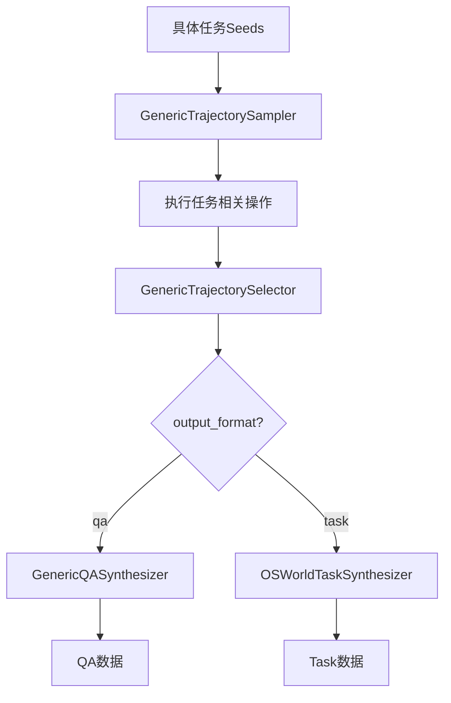
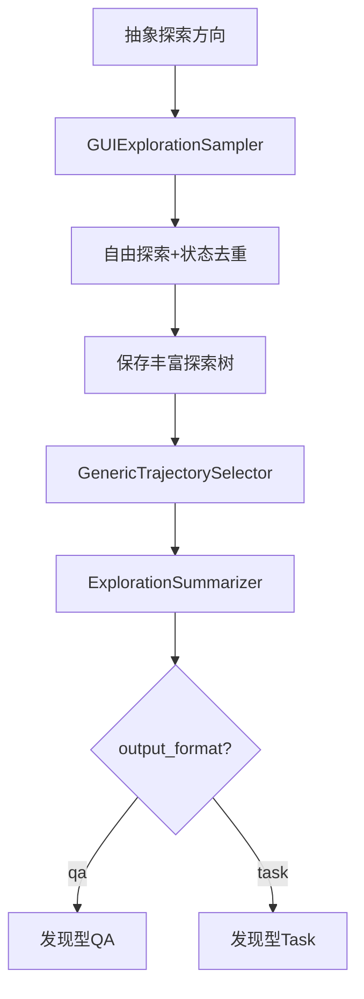

# 探索式 vs 目标导向 - 完整对比

## 🎯 两种范式

### 目标导向范式（原有）

**理念：** 已知任务 → 执行 → 验证

```
Seeds: ["安装Spotify", "创建文件夹"]
  ↓
采样：为完成特定任务而操作
  ↓
结果：基于任务生成QA/Task数据
```

### 探索式范式（新增）⭐

**理念：** 探索 → 发现 → 总结

```
Seeds: ["探索文本编辑器", "探索文件管理"]
  ↓
采样：自由探索，发现功能
  ↓
结果：从探索中提炼出多个任务
```

## 📊 详细对比表

| 维度 | 目标导向 | 探索式 |
|------|---------|--------|
| **Seeds类型** | 具体任务指令 | 抽象探索方向 |
| **Seeds示例** | "安装Spotify"<br>"创建文件夹MyProjects" | "探索系统设置"<br>"探索文本编辑器功能" |
| **采样目标** | 完成预定任务 | 发现和理解应用 |
| **采样器** | `GenericTrajectorySampler` | `GUIExplorationSampler` ⭐ |
| **状态管理** | 无状态追踪 | 状态指纹去重 ⭐ |
| **重复控制** | 无特殊处理 | 自动避免重复状态 ⭐ |
| **轨迹保存** | 简化版 | 完整版（截图+a11y树）⭐ |
| **数据丰富度** | 基本信息 | 完整exploration上下文 ⭐ |
| **选择器** | `GenericTrajectorySelector` | 同左 |
| **合成器** | `GenericQASynthesizer`<br>`OSWorldTaskSynthesizer` | `ExplorationSummarizer` ⭐ |
| **合成方式** | 基于轨迹"生成"问题 | 从探索中"发现"任务 ⭐ |
| **一个seed产出** | 通常1-3个QA/Task | 可能5-10个发现 ⭐ |
| **数据多样性** | 较低（局限于seed） | 较高（一次探索多个发现）⭐ |
| **配置文件** | `osworld_config.json` | `osworld_exploration_config.json` |
| **入口脚本** | `synthesis_pipeline_multi.py` | `exploration_pipeline.py` ⭐ |
| **提示词风格** | 任务导向 | 探索和发现导向 ⭐ |

⭐ = 探索式的独特优势

## 🔄 工作流程对比

### 目标导向流程



### 探索式流程 ⭐



## 💡 使用场景

### 目标导向适合

✅ **明确知道**要生成什么任务
✅ **批量生成**特定类型的任务
✅ **快速迭代**已知任务变体
✅ **评测基准**构建（已知任务列表）

**示例：**
```json
[
  "Install Google Chrome",
  "Install VLC Media Player",
  "Install GIMP"
]
```

### 探索式适合 ⭐

✅ **不确定**应用有哪些功能
✅ **发现**新的任务可能性
✅ **多样化**数据收集
✅ **应用理解**和功能挖掘

**示例：**
```json
[
  "探索图片编辑应用",
  "探索音频播放器",
  "探索系统工具"
]
```

## 📁 文件结构对比

### 目标导向

```
data_synthesis/
├── synthesis_pipeline_multi.py      # 主pipeline
├── trajectory_sampler.py            # 采样器
├── qa_synthesizer.py                # QA合成
├── task_synthesizer.py              # Task合成
├── configs/
│   └── osworld_config.json          # 配置
└── example_seed_gui_tasks.json      # 具体任务seeds
```

### 探索式 ⭐

```
data_synthesis/
├── exploration_pipeline.py          # 探索pipeline ⭐
├── exploration_sampler.py           # 探索采样器 ⭐
├── exploration_summarizer.py        # 探索总结器 ⭐
├── configs/
│   └── osworld_exploration_config.json  # 探索配置 ⭐
└── example_seed_exploration.json    # 探索方向 ⭐
```

## 🚀 快速对比

### 运行命令

**目标导向：**
```bash
python synthesis_pipeline_multi.py \
  --config configs/osworld_config.json \
  --seeds example_seed_gui_tasks.json \
  --output-dir results
```

**探索式：**
```bash
python exploration_pipeline.py \
  --config configs/osworld_exploration_config.json \
  --seeds example_seed_exploration.json \
  --output-dir exploration_results
```

### 输出对比

**目标导向输出：**
```
results/
├── synthesized_tasks_osworld.jsonl  # 或 synthesized_qa_*.jsonl
└── trajectories_osworld.jsonl
```

**探索式输出：**
```
exploration_results/
├── exploration_tasks.jsonl          # 或 exploration_qa.jsonl
├── exploration_trees.jsonl          # 汇总
└── tree_explore_XXXX_XXXX.json      # 每个探索的完整树 ⭐
```

## 🎓 Seeds设计对比

### 目标导向Seeds

```json
{
  "good": [
    "Install Spotify on the system",
    "Create a folder named 'Projects' on Desktop",
    "Open text editor and save a file",
    "Change system wallpaper"
  ],
  "bad": [
    "Explore text editors",  // 太抽象
    "Use the computer",      // 太宽泛
    "Do something"           // 无意义
  ]
}
```

**特点：**
- 明确的动作
- 可验证的结果
- 具体的对象

### 探索式Seeds ⭐

```json
{
  "good": [
    "探索文本编辑器的功能和选项",
    "探索文件管理器的各种操作",
    "探索系统设置的配置面板",
    "探索图片查看器的工具栏"
  ],
  "bad": [
    "安装Spotify",           // 太具体（应该用目标导向）
    "创建文件夹",            // 太具体
    "探索所有应用"           // 太宽泛
  ]
}
```

**特点：**
- 抽象的方向
- 开放式探索
- 应用级别的范围

## ⚡ 性能对比

| 指标 | 目标导向 | 探索式 |
|------|---------|--------|
| **单个seed时间** | 5-15分钟 | 10-30分钟 |
| **生成数据量** | 1-3个/seed | 3-10个/seed ⭐ |
| **数据多样性** | 中等 | 高 ⭐ |
| **存储需求** | 较小 | 较大（完整树） |
| **VM资源** | 中等 | 较高 |

## 🔧 配置对比

### 关键配置差异

**目标导向：**
```json
{
  "sampling_tips": "完成任务的策略...",
  "synthesis_tips": "如何生成QA/Task...",
  "max_depth": 6,
  "branching_factor": 2
}
```

**探索式：**
```json
{
  "sampling_tips": "探索和发现的策略...",  // ⭐ 强调探索
  "synthesis_tips": "如何总结发现...",     // ⭐ 强调总结
  "max_depth": 8,                         // ⭐ 通常更深
  "branching_factor": 2
}
```

## 📊 输出数据对比

### 目标导向输出示例

```json
{
  "id": "src_0001_task_0",
  "question": "I want to install Spotify. Could you help me?",
  "config": [],
  "evaluator": {...}
}
```

**特点：** 直接针对seed任务

### 探索式输出示例 ⭐

```json
{
  "id": "explore_0001_task_0",
  "question": "Create a new text document and save it to Desktop",
  "config": [],
  "evaluator": {...},
  "metadata": {
    "exploration_seed": "探索文本编辑器",
    "synthesis_type": "exploration_summary",  // ⭐ 标记为探索发现
    "discovered_operations": ["new_file", "type_text", "save"]
  }
}
```

**特点：** 从探索中发现的任务

## 🎯 选择指南

### 何时使用目标导向？

1. ✅ 已有明确的任务列表
2. ✅ 需要批量生成类似任务
3. ✅ 构建特定领域的评测集
4. ✅ 快速迭代和验证

### 何时使用探索式？ ⭐

1. ✅ 不确定应用有哪些功能
2. ✅ 想要发现新的任务类型
3. ✅ 需要高多样性的数据
4. ✅ 进行应用功能分析
5. ✅ 构建开放域训练集

## 🔀 混合使用策略

### 阶段1: 探索式发现

```bash
# 使用探索式发现应用功能
python exploration_pipeline.py \
  --config configs/osworld_exploration_config.json \
  --seeds exploration_directions.json \
  --output-dir phase1_exploration
```

**产出：**
- 发现的任务类型
- 应用功能清单
- 有价值的操作序列

### 阶段2: 目标导向扩展

```bash
# 根据发现的任务，用目标导向批量生成
python synthesis_pipeline_multi.py \
  --config configs/osworld_config.json \
  --seeds discovered_tasks.json \
  --output-dir phase2_expansion
```

**产出：**
- 任务变体
- 规模化数据

## 💻 实际案例

### 案例1: 文本编辑器

**目标导向：**
```
Seeds: ["打开编辑器并保存文件", "创建带标题的文档"]
产出: 2个任务（各1个变体）
```

**探索式：**
```
Seeds: ["探索文本编辑器功能"]
产出: 8个任务
  - 创建新文档
  - 保存文件
  - 修改格式
  - 使用快捷键
  - 查找替换
  - 撤销重做
  - 打印预览
  - 更改偏好设置
```

### 案例2: 系统设置

**目标导向：**
```
Seeds: ["更改壁纸", "修改显示分辨率"]
产出: 2个任务
```

**探索式：**
```
Seeds: ["探索系统设置面板"]
产出: 15个任务（涵盖网络、显示、声音、电源等多个类别）
```

## 📈 数据质量对比

| 质量维度 | 目标导向 | 探索式 |
|---------|---------|--------|
| **任务明确性** | ⭐⭐⭐⭐⭐ | ⭐⭐⭐⭐ |
| **操作完整性** | ⭐⭐⭐⭐ | ⭐⭐⭐⭐⭐ |
| **上下文丰富度** | ⭐⭐⭐ | ⭐⭐⭐⭐⭐ |
| **数据多样性** | ⭐⭐⭐ | ⭐⭐⭐⭐⭐ |
| **可复现性** | ⭐⭐⭐⭐⭐ | ⭐⭐⭐⭐ |
| **发现能力** | ⭐⭐ | ⭐⭐⭐⭐⭐ |

## 🎉 总结

### 目标导向的优势

✅ 任务明确，易于验证
✅ 执行速度快
✅ 适合已知任务批量生成
✅ 配置简单

### 探索式的优势 ⭐

✅ 发现未知任务
✅ 数据多样性高
✅ 一次探索多个产出
✅ 丰富的上下文信息
✅ 真实反映应用使用
✅ 避免重复和无效探索

### 推荐策略

```
阶段1（发现）: 使用探索式
    ↓
分析探索结果，识别有价值的任务类型
    ↓
阶段2（扩展）: 使用目标导向批量生成变体
    ↓
组合两者的产出，构建高质量数据集
```

---

**文档版本：** v2.0
**更新日期：** 2025-11-10
**状态：** ✅ 完整实现

